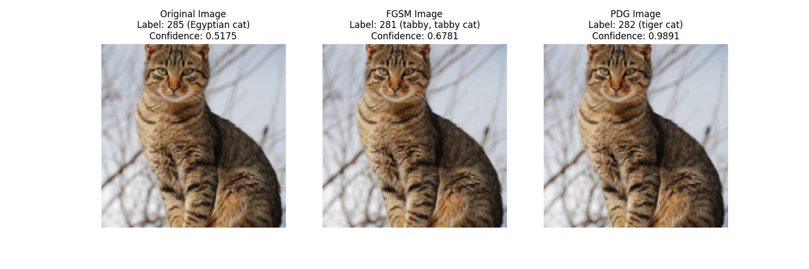

# Adversarial Noise

This package contains two types of adversarial noise.

## Installation

To install the package, follow these steps:

1. Clone the repository:
    ```bash
    git clone https://github.com/mattiagaggi/adversarial_noise
    ```

2. Make sure you have Python 3.11 installed. Create a virtual environment using:
    ```bash
    python3.11 -m venv env
    source env/bin/activate
    ```

3. Navigate into the repository and install the package:
    ```bash
    cd adversarial_noise
    pip install .
    ```

## Running the Demo

To run the demo, follow these steps:

1. Ensure you have installed the package (see Installation steps).

2. Run the demo script:
    ```bash
    cd demo
    python demo.py
    ```

The demo will output the results. The results are also shown below:



### Comments and Next Steps

As expected, PGD is more effective than the basic method. A lot of improvements can be made from here.

## License

This project is licensed under the MIT License.
